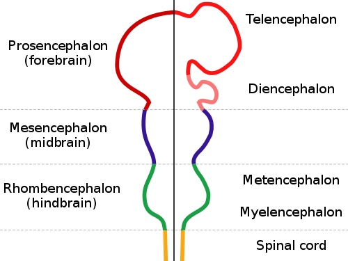
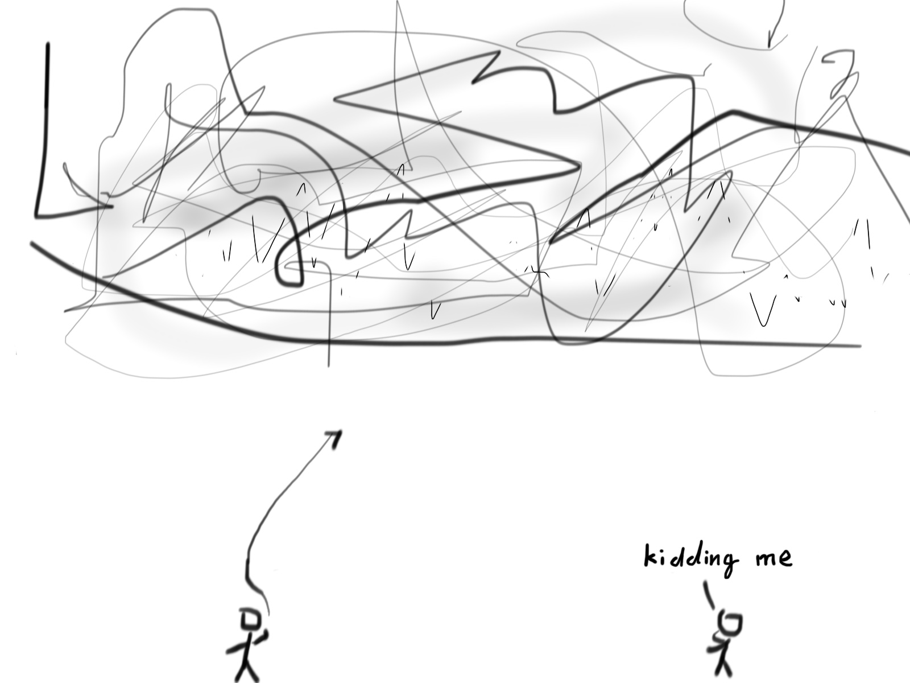
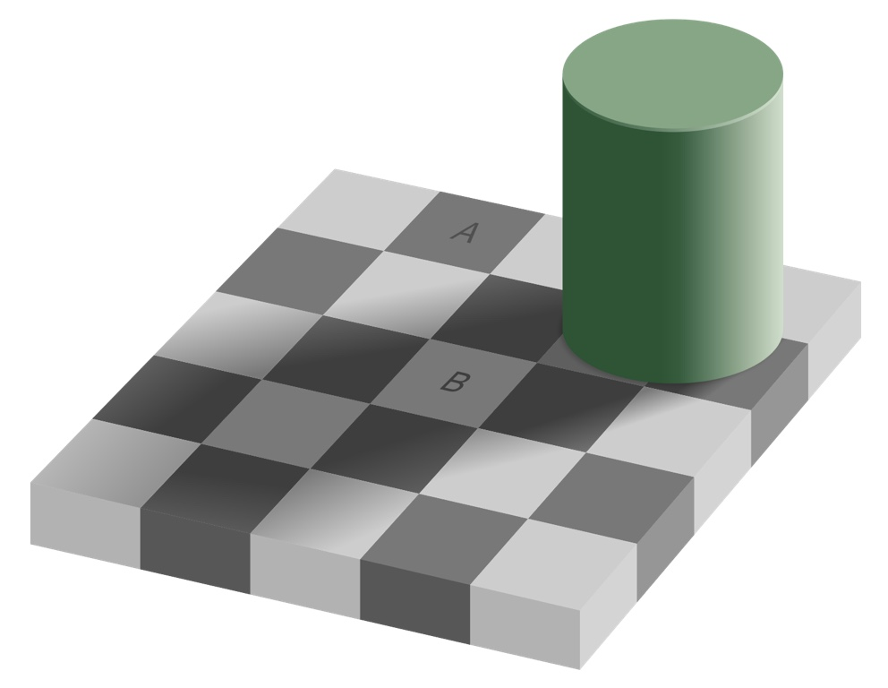
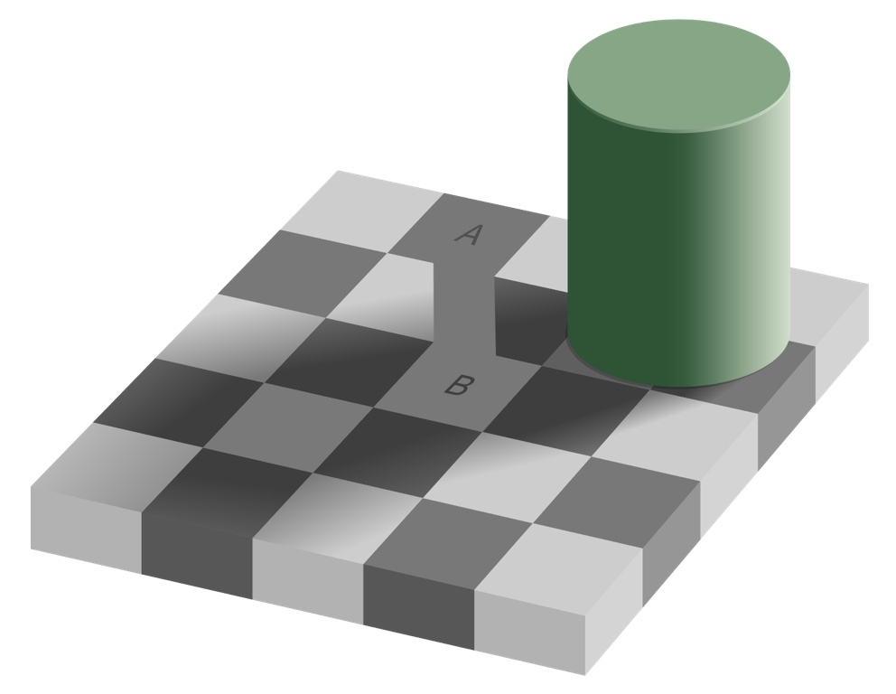
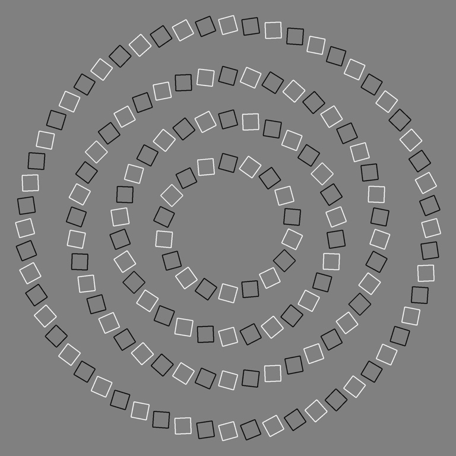
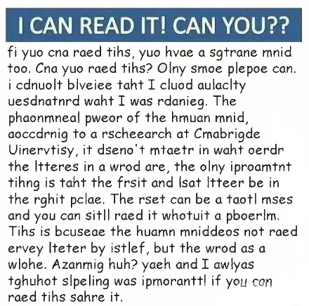
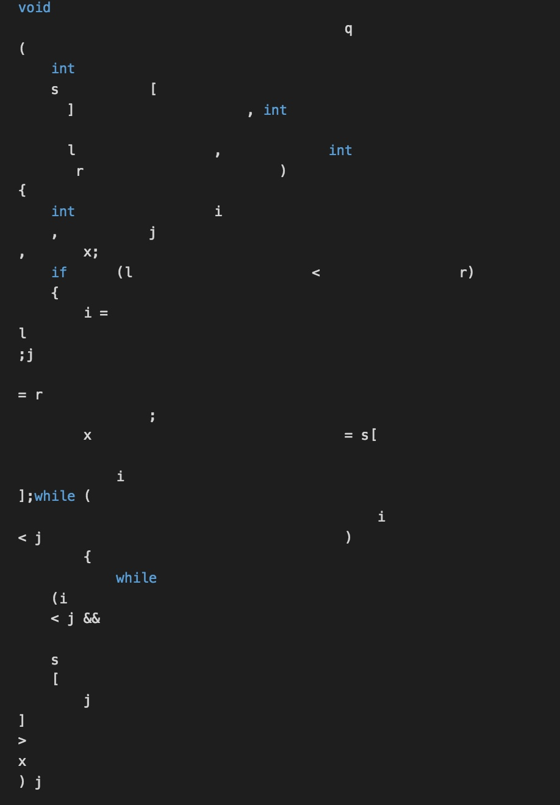

# 你和人工智能

T_T 唉没想到已经写了一个星期了等集够赞再补全 T_T

本文是一篇很久前就打算写的综述，目的是让我们对人工智能更加“了解”。

人工智能最近无论是因为比较实质的技术进步，还是商业圈的人为炒作，变成几乎家喻户晓的话题。但是，它也变成了各种无聊和反智话题的重灾区。类似于“计算机要全面压倒人类”，“只是计算机暴力求解的快”，“xxxxxx是量子的”，“xxxxx本质上是一样的”，“xxxxx本质上是不同的”，“只有xxxxx才能创造xxxx”。各位我奉劝一句，各种动不动上“量子”、“本质”、“宇宙”、“无限”、“只是”、“不过” 这些词调的话语大抵谨慎一些，这些论调大多是为了宣传，夸张，装逼。这些话语的共同特点是可以在后面加上感叹号，从而刺激情绪和评论，而不是理智的思考。

下面给出两个例子：

Case A

科学家说，人脑是量子的。量子计算机可以瞬间破解现有的一切密码，被认为是下一代超强计算机。量子力学告诉我们，量子之间可以产生鬼魅般的纠缠，这种纠缠有着超距的作用，连爱因斯坦都无法理解。所以人脑是量子的可能和自主意志的产生有关。最近美国科学家的研究指出锂原子间可能发生“超纠缠”，从而让人拥有自主意志。所以目前的AlphaGo等仅仅是弱人工智能，和人类真正的智能是有本质的区别的。而下面量子计算机等发展会有真正的自主意识出现，著名的量子理论家霍金也感到害怕。

Case B

根据最近的一些研究[53][54][55]指出量子效应有可能在自主意识的形成中发挥了关键性的作用[56]。B.C Bostan， Astrabillion et al. 提出了锂原子核自旋和大脑中某些物质的作用可能就是一种可以在脑内长期存在的量子现象[57]。锂盐长期以来被用于治疗精神分裂等疾病，但是大量证据表明锂的一种同位素的治疗效果要好于另外一种[58]，但是两者的化学性质几乎没有差异。B.C Bostan 等在 [57] 中提出很可能是锂原子核自旋在其中发挥了重要作用，于是也可以预期其他某些原子的核自旋也可能显著的影响到了意识。但是 Casteria, Rosekappa 等人指出[60]，即使核自旋等量子态确实影响到了意志，也不能说明量子作用是大脑最主要的工作机制。因为锂原子等可能只是和某些蛋白受体发生了某种非常规的量子效应更加明显的作用，这种作用仅仅是分子层面的，宏观层面上和普通化学反应没有区别，和“自主意识的形成中关键性的作用”不能混为一谈。

当然上面两个 Case 都是假造的（不过下面确有其事，只是人名不同）。但是下面的要靠谱很多，因为其大量的引述，和非常特殊的用词，可以方便你去查证

而 Case A 可以很不违和的加上标点，从而体现它潜在的语气：

科学家说，人脑是量子的！量子计算机可以瞬间破解现有的一切密码！被认为是下一代超强计算机。量子力学告诉我们，量子之间可以产生“鬼魅般的纠缠“，这种纠缠有着超距的作用，连爱因斯坦都无法理解！所以人脑是量子的可能和自主意志的产生有关。最近美国科学家的研究指出锂原子间可能发生“超纠缠”，从而让人拥有自主意志。所以目前的AlphaGo等仅仅是弱人工智能，和人类真正的智能是有本质的区别的！而下面量子计算机等发展会有真正的自主意识出现，著名的量子理论家霍金也感到害怕！

很快你就明白，这就是炒作的技巧：调度感情，大量潜在的语气和装逼的用词。

仔细一看漏洞百出：

科学家说（谁？），人脑是量子的（论文标题断章取义）！量子计算机可以瞬间破解现有的一切密码（夸张）！被认为是下一代超强计算机（谁认为？你自己？）。量子力学告诉我们，量子之间可以产生“鬼魅般的纠缠”，这种纠缠有着超距的作用，连爱因斯坦都无法理解（和全文不直接相关，另外“不理解”和“不接受”不是一个概念）！所以人脑是量子的可能和自主意志的产生有关。最近美国科学家（可能根本不是美国的）的研究指出锂原子间可能发生“超纠缠”（盗用词汇），从而让人拥有自主意志。所以目前的AlphaGo等仅仅是弱人工智能（拿热门例子吸引眼球），和人类真正的智能是有本质的区别的（谁说的？）！而下面量子计算机等发展会有真正的自主意识出现（从哪里来的结论？），著名的量子理论家霍金也感到害怕（偷换主体事件）！

下面我将尽我所能探讨深入探讨一些问题，为了阻止“小学生”的存在，我不介意使用大量英文词汇。

### AI Effect

首先，我们有必要要谈谈 AI 心理学效应，我们称为 AI Effect \[3\]\[4\]

AI 相关的研究被认为始于1956年, Dartmouth College 的会议上 \[5\]. 与会者包括 John McCarthy, Marvin Minsky, Allen Newell, Arthur Samuel and Herbert Simon。他们成为了 AI 研究的先驱。

当时他们和学生们开发了一些程序，类似于捕获对方关键字来回复的聊天机器人，并且所有操作都是程序写死的。虽然现在看来毫无神秘可言，但是当时的人们却非常惊奇[2]

当国际象棋中深蓝第一次打败卡斯帕罗夫\[10\] 的时候，人们是大为惊奇的。等到去年 AlphaGo 击败李世石，很多人已经不感到奇怪了。反倒有一些人嚷嚷着 “德州扑克、麻将是电脑无法击败” 类似的言论，犹如当年深蓝后人们就怀疑“电脑没办法在围棋上下过人”。

可以预想我们今后对 AlphaGo 下围棋的的态度。可能过了相当长时间后我们会觉得“没什么好奇怪的”

这种态度早有人总结：

Artificial Intelligence is whatever hasn't been done yet. - Larry Tesler

A problem that proponents of AI regularly face is this: When we know how a machine does something 'intelligent,' it ceases to be regarded as intelligent. If I beat the world's chess champion, I'd be regarded as highly bright. - Fred Reed

Every time we figure out a piece of it, it stops being magical; we say, 'Oh, that's just a computation. - Rodney Brooks

说白了，AI Effect 源自于我们对“智能”的不理解，以及大众对于社会科技发展的适应性。将惊奇变为习惯也是人的强大适应力的表现。

这个时代总是让我们略微感到惊奇然后又很快归于平淡，但是回头一看已经走了很远了。即使很激进的观念，也可能会被未来的我们所接受并且习以为常。

如果想要知道更多 AI 相关的历史，可以参考 \[6\] \[7\] \[8\] \[9\]。

下面我们正式开展话题。

### 表观智能

下面我们用“表观智能”指代“操作定义（operational definition）的智能”。

表观智能是指，无论它如何实现的，它表现出智能的特性，则称之为智能。

T_T 吐槽开始
（好吧我身边没有数位板）
吐槽结束 T_T

表观智能是实用的。试想一个情况：外星人制造了一堆专门用来侵略的傀儡机器人把人类打败了，但是人类并不知道背后到底是谁，只知道打败自己的是一堆没有自主意志的东西。人类能够以“打败我们的东西没有独立思考能力”为由，反败为胜？显然不能，这是很荒唐的事情，毕竟输了就是输了。外星人应该选择能够打败对方的方式，而不是“内在表现出智能”的方式。

T_T 显然世界地图不是这样的，以及我画不圆 T_T

关于表观智能一个很著名的例子是 Tom M. Mitchell 提供的对机器学习的形式化定义： "A computer program is said to learn from experience E with respect to some class of tasks T and performance measure P if its performance at tasks in T, as measured by P, improves with experience E." [11] 

按照这个定义，责难一个机器学习程序“本身并不智能”是没有道理的，因为它的定义只看效应而不管如何实现它。例如对于下棋，只要下赢就可以承认它是一个“比人更强的机器学习程序”，无论是使用深度学习，还是使用 MCTS，还是用 SVM。

这样的好处是可以不至于一直停留在空谈和思辨的层面，而是动手想办法作出实事。

Tom M. Mitchell 的定义导致 Alan Turing 在 "Computing Machinery and Intelligence" 这篇论文中将  "Can machines think?" 改为了 "Can machines do what we (as thinking entities) can do?" [12] ，并且和著名的图灵测试密切相关。

图灵测试实质上是一种黑箱benchmark（黑箱基准测试），黑箱benchmark就是评测“表观能力”的一种方式，例如考试，某种测试，锦标赛等等。黑箱benchmark在约定好的规则下，不加区分的公平测试每个选手，从而去处“内在因素”（对于运动会，内在因素就是民族，血型，信仰等等；一个极端的例子是比如是黑种人就在运动上歧视他，觉得他只是靠蛮力和野性，并不是“真正”的运动成绩；对待人工智能人们也常常有这种态度，因为觉得它“没有自主意识”而觉得它都是靠蛮算，从而低人一等）。越优秀的 benchmark 越能正确反应参试者水平。

benchmark 的一个典型例子是每年 Top500 名单，公布世界上最快的500个超级计算机排名。方法是运行名为“LINPACK”的基准测试（主要内容是求解大规模的线性方程组），比较结果，从而不必争执谁的内部体系结构如何如何，到底哪个先进。为了体现更好的综合性能，HPCG 这个 benchmark 很可能会加入到未来的 Top500 测试中。

这种黑箱测试会引入一种奇妙的情况：如果两个学识能力相近的人分别被关到一个小房间里面，外面的测试者试图测试他们的各种能力，包括运算、记忆、推导等等。试想一下，如果其中一个人两手空空，另外一个人有一个本子和一支笔，那么外面的测试者会有什么结论？结论显然是一方的表观智能对于另一方是碾压性的：算得又快又不容易错，一长段话能记得一字不漏倒背如流，告诉他一大堆复杂人物关系他一下子就能推出来，复杂的公式也能很快化简，考个证明也是完虐对面。

这个有趣的现象让我们思考：为什么一个本子和一支笔能够显著的提高表观智能？本子自己显然没有“智能”可言。但是那个人本身没有本子也不至于看上去那么厉害。是人和一个本子和一支笔三个东西的结合产生了更强的智能，还是纸的制造、运输、销售者的智能的间接体现？苏轼也在《论琴》中表示过类似的观点，就是弹奏着和琴之间的关系。

更有意思的事情是，一个有电脑能联网的人和另外一个人的差距更加大，几乎是神和人的差距：一个人可以瞬间算一个数的几百次方，知晓 wikipedia 中所有词条的内容，实时“感知”到最近的社会动态，“预测”一周的天气，知道自己在地球上的位置，让一堆素不相识的人从几百公里外送来包裹，而包裹里面的东西是全世界各国各地数不清的人和工厂组装起来的。同样的，能联网的电脑有”智能“吗？这是一个值得思考的问题。另外，这个例子强烈体现了外界服务的影响，这个我们之后讨论。

反对表观智能的典型理论是 John Searle 的 中文房间悖论[13]。一个房间里面的人可能因为查字典而表现的会中文，实际上他自己并不懂中文。按照这个观点，人和一个本子和一支笔，他们的“总体智能”中不应该包含本子和笔，因为他们并没有实质的“理解能力”，结合起来变的强大是因为那个人潜在智能（利用纸和笔）的体现。

T_T（嗨这上面是中文房间的配图啊）T_T

中文房间悖论一定意义上是把一个系统的“真正智能”归咎于一个具体个体，而不是系统本身。如果这个具体个体不存在，那么智能就是一个假象。按照这个论点，各个零件拼起来的，并不了解自己干什么的机器并不具备“强人工智能”（强人工智能认为 The appropriately programmed computer with the right inputs and outputs would thereby have a mind in exactly the same sense human beings have minds [14]）

中文房间悖论也有自身难以解释的东西存在：脑细胞每个都没有自主意识和智能，但是为什么它们的总体却有呢？

### 智能和类人

比较细心的人会发现，上述的图灵测试实质上是一个模仿人的测试，而不是一个评价智能的测试。这是个很无奈的事情，我想图灵原先的意思是用来衡量智能，但是可惜除了人以外智能并没有标尺，于是退而求其次。

一个问题是，人现在这个样子是最智能的吗？

显然不是。原因很多。比如人很多地方不如计算机效率高，并且有计算机的效率原则上不和我们的存在有过于明显的抵触，只是因为我们没有进化出类似的能力，从而需要后天学习来掌握各种计算，并且效率依然远远落后于计算机。一个运算速度极快的人很有可能通不过图灵测试，这是很荒唐的。

第二个问题是，人现在的大脑结构是最优的吗（即使不是最智能的，也可以拥有最智能的结构）？

几乎可以说不是。首先生物系统固有的缺陷是易死亡，易衰老，易疲劳，难移植。另外人脑是进化而来的，每次脑部进化都是在旧的层次上面直接添加新的层次（比如脑干，情感边缘，旧皮层，新皮层）。这让人常常出现控制不住情绪等情况。

T_T 可以不翻译图中内容吗 T_T

所以，人类也只是智能的一种标杆而已，我们知道自己或许在某个方面不如某个动物或者某个机器，但是从来也没有见过各个方面比我们都高的。直到出现了超越我们智能的对手，我们才能得以衡量自己的智能究竟是何程度。

### 对人和机器一致的计算限制

我们谈论智能，常常会涉及到计算，我想其根源在于基本确信的事实是神经系统通过电信号控制和感受身体其他部分。在这个事实下，大脑和计算的工作模式是类似的，即通过处理输入的信息，产生输出的信息，而这正是的计算的定义 -- 对信息的处理。

这种观点受大量的事实支持，因为输血、输液、移植器官这些行为都没有显著改变意识，并且把手臂改为人造机械臂并没有显著阻碍运动控制，较先进的人工耳蜗也能比较真实的产生听觉 [18]，这些都间接表面了大脑是独立于外部的信息处理为主的器官，也就是和计算非常相关。

(上图是操作机械臂的猴子，机械臂直接受大脑信号控制)

我们已经知道，很多计算任务，对人和机器一样的难。一个例子是普通的算术运算，虽然计算机看上去比人快太多，但是那只是一个常数级别的快，如果人每个操作和晶体管的门电路差不多快那么两者是不相上下的。

我们还知道另外一个显然的结论是，**我们至少不弱于任何机器**。因为如果你精通一个机器的运作原理，那么你就可以模仿它的每一个操作，或者我们制造另外一个类似的机器来模拟它达到类似的效果，也就是我们至多比机器慢一个常数。

T_T 写字写了5分钟 T_T

那么机器（特别是计算机）又有什么地方不弱于人呢？一个显著的答案是，只要一个问题能够有明确的算法，那么计算机就不输于人类。因为在执行一个“表述明确”的算法，也就意味着我们必须要严格按照算法的步骤执行（如果你其中使用了一些技巧来简化流程，那么其实是产生了一个新的算法。你需要保证计算机真正使用的算法和你的完全相同，这样才是“公平”的比试），计算机几乎每步都会比我们快。那么哪些东西可以变成算法呢？很有趣的一个事实是算法几乎等价于我们“非常清楚”的事情，也就是我们能够写出一个详尽的解决方案的事情，比如求解方程组（科学计算）、商务交易（电子商户）、通信协议和数据递交（计算机网络）、物理过程（分子动力学、流体力学、应力模拟等）、符号数值计算（Mathematica, Maple, Matlab）、形式化的自动定理证明(coq)等等等等，这些都可以用算法表述。

有些问题算法不能准确描述（或者很难写出非常具体的算法），但是计算机同样可以解决，只要它的解有限且可以被验证。典型的问题是搜索问题，比如下棋（特别是复杂的棋类）。下棋本身的过程我们并不能非常好的理解，很多都是经验积累和直觉，因此我们很难写出一个“非常具体的算法”。但是我们知道下棋的步数（更准确的说是状态数）是有限的，因此可以使用搜索的方式来完成任务。你可能会质疑搜索本身也是一种特殊的算法，确实如此。但是搜索与其不同的一点是，我们仅仅需要一个问题的准确定义，就可以用搜索解决这个问题，而不需要构造完整的解决方案。执行搜索其实很多时候是无奈之举，因为我们实在没有办法描述一个精确的解决方案，比如一个行为复杂的棋的最优对策，虽然它明显是存在的。

事实上早期AI的很多突破都在搜索上面。搜索可以采用很多技巧，诸如A\*，alpha-beta剪枝，双向BFS等等。对于搜索空间过大的问题可以采用某种随机的方式，诸如蒙特卡洛树搜索(MCTS)来求得非最优的解。

那么是否有计算机不可计算的问题呢？

有，其中一种就是停机问题。[15]

T_T 未完成的插画:

\-\- When you come back to work?
\-\- Until the program stops. 

T_T

停机问题本身很简单，就是给定一个程序，判定它是否会终止。这可以规范成一个非常严格的表述。它和数理逻辑中著名的 Gödel's incompleteness theorem [16] 也有很大关联。

大部分数学命题都可以用一个程序是否停止表示，比如说哥德巴赫猜想可以表示为一个顺次检验各个整数是否满足猜想假设的程序是否会终止（比如找到一个反例那么程序就停止，那么终止就意味着命题证伪，否则就是命题成立，因为没有找到一个反例程序就不会终止）。

停机问题可以被计算就意味着大量的数学问题可以被计算机直接证明(通过判断对应的程序是否停机)，显然这太天真了。事实是你找不到一个方式能够确定一个程序终止，同时这个方式又能确定有限步终止。

(很多类似问题不能解决的原因都是自指，说谎者悖论可能是最简单的一种)

问题是，人能够解决不可计算问题（比如停机问题）吗？

Roger Penrose 在他的著作《皇帝新脑》中认为可能 [17]。但是目前似乎大多数人持反对态度。 

这里给出一个直观的印象：有些问题，比如一般性的检验所有的实数的某个性质，是计算机做不到的（一个常识是实数比整数多，因而是不可数的无穷多）。但是你显然知道所有的实数的平方大于等于0等等性质，这些涉及到“无穷多”，似乎是计算机不能“暴力计算”的。这也是很多民科给的理由。

T_T 未完成的插画:

\-\- Look! I can deal with infinite number of items!
\-\- Yeah, but always with finite steps.

T_T

但是，不要忘记一个事实是，所有的证明的步数都是有限的，基本公理和假设也只有有限个，所有的定理都由公理和定义在有限步之内证明。所以coq等软件可以严格按照条件证明很多命题。

早在计算机问世不久的上世纪 50 年代，一些美国数学家——其中包括华裔数学家王浩——就用计算机证明了英国哲学家罗素 (Bertrand Russell) 和怀特海 (Alfred North Whitehead) 的名著《数学原理》(Principia Mathematica) 中一阶逻辑部分的全部定理；另一些数学家——其中包括中国数学家吴文俊——则用计算机证明了许多几何定理。而最轰动的则是 1976 年，美国数学家阿佩尔 (Kenneth Appel) 和德国数学家哈肯 (Wolfgang Haken) 用计算机辅助证明了四色定理 (Four color theorem)——一个从未被常规手段证明过的定理。

T_T 需补：上面一大段内容的确切来源引证（人名和著作太多），虽然这些都是常识 T_T

如果我们知道对于某个问题证明行数的一个上限，那么我们确实可以用计算机求解（哪怕暴力排列所有的公理和定义，当然这里没有这么简单，我不愿意展开说太多）。但是很多问题我们确实不知道它被证明的最少行数（否则我们可以很有信心的用计算机求解，就像四色定理证明中就是规约到了有限种，虽然是很多种情况，但是对于计算机没有太大压力），如果黎曼猜想的证明不少于3000万行，那么对于人来说似乎也没有什么特别好的方式，因为即使把证明抄一遍可能一生都不够。

T_T 唉，没有数位板 T_T

### 没有免费的午餐

“没有免费的午餐”，是一个真实的定理 (No free lunch theorem)，最早用于机器学习问题 [19]，后来被拓展到优化和搜索 [20].

这个定理表明了，在绝对一般的情况下，并不会有哪种方法表现的更好，或者说对于一般性的东西没有比瞎猜或者暴力求解更好的解决方案。

现在我们讨论这个定律对于人和AI的限制。AI 显然制约于它，这是我们清楚的。那么人呢？

很多证据暗示人也不能做的更好，或者仅仅对于特殊的情况可以做的比较好。这些行为往往可以表现在错觉上（特别是偏认知的错觉）。但是错觉，不一定是bug，还有可能是feature（这个将在后面分析），不过错觉确实表明了人的认知的一些局限性，或者“偏激”的地方，虽然这种局限很有用。

比如下面的图中，A 和 B颜色相同吗？

答案是：

原因是，人脑会自作主张的消除阴影对颜色的影响，从而你看到的不是真实的颜色。

下面是更加极端的例子（中间的条带是纯色的吗？）：

还有，下面的人什么表情？（可以倒过来看看）

白色的三角形存在吗？（但是从神经电位来看人们确实不经意的觉得它存在）

同心圆？

以及下面是英文吗？

中文也存在这个情况，（或者大多数语言都是如此）

但是上面真的是合乎语法的汉语吗？虽然你不认为这个严重影响阅读，但是实际上这是一种偏激的做法：你无意中扩广了汉语语法的范围。

当然，不是所有的语言都没用问题，比如下面代码片段（没有写全）可能会影响你的阅读体验（编译器说这很正确）：

T_T 知道为啥我不看有些人的代码了吧 T_T

其实还有很多声音、温度方面的错觉（都是基于认知的，当然还有大量感官导致的错觉不过显然不在本文讨论之中）

T_T 正在补全这些错觉图的来源和历史 T_T

### 插入话题：人脑是量子的吗？

首先这个问题不够严格。应该说有意思的问题在于人脑在大尺度上面（大于细胞尺度）是否必须依赖量子效应。

必须澄清的一点是，在低能领域，所有的物理过程都是严格遵守量子效应的，不管是化学反应还是晶体管，它们都是“量子”的，或者说量子物理的固体物理能带理论恰恰是现在计算机赖以运行的原理（因为它们需要可以工作的半导体）

脑中的化学反应当然也是量子效应的体现，甚至核自旋等效应都会影响到大脑运作，或者很多关键的局部机制依赖量子隧穿（比如某些离子通道）和量子纠缠，某些候鸟可能也会通过量子机制来感知磁场，甚至也有人argue说人之间也有感应。但是这和意识本身受到量子效应影响不是同一个意思，就和晶体管本身依赖微妙的量子效应，但是我们不把一般的计算机叫量子计算机一样。

Roger Penrose [17] 是人脑量子论的支持者。但是大多数人持反对态度，包括 Scott Aaronson [21] 等直接从事量子计算的人。

反对人脑是量子的至少有两种方式：

1. 人脑大尺度上不存在明显的量子效应
2. 人脑大尺度上的量子效应不是不可或缺的

第1点的证据在于人脑如此高的温度和复杂的化学反应介质下， 宏观的量子效应很难维持 [22][23]。大量的液体从脑中流入流出，带着复杂的可测量的生物电发射和静息，这些情况对于宏观量子效应非常不利，或者说近于致命的打击。生物进化中没有必要为如此费用高昂的效应买账。

第1点的间接证据还有对人脑的各种宏观观测（脑电图，核磁共振，CT，电极接入，以及对动物的转基因荧光染色），都可能会导致宏观的量子态的坍缩（量子力学中观察致“波函数坍缩”是个常识），也就是可能会破坏当前的量子态，但是实际中这些行为并没有影响人的意志。除非量子效应在非常小的尺度（到细胞级别）起作用，但是这样就如之前声称的一样，这种规模的效应没有什么意思。

另外还有，脑细胞并没有比其他细胞有太过于体现量子效应的地方（毕竟都从一个细胞分化过来），聚集起来就有量子效应是非常可疑的。

第2点的证据更多。

首先，我们知道了不需要宏观的量子效应就可以识别声音，识别图像，下围棋等等，而且很多都超越了最优秀的人类。这暗示简单的经典效应足以胜任这些事情，何况异常复杂的大脑。而且以后的时间中机器每做到一个，我们可能都要把候选名单上一些条目删去。

第二，生物进化角度。人的脑细胞没有明显异于低等生物脑细胞的地方。低等生物脑中量子效应几乎可以肯定是不存在的，因为我们知道他们的一举一动。如果到人类就突然有了量子效应是不合生物进化常理的。另外，较早期人类也没有表现出非常过人的智能。

第三，有一些机制我们已经明白完全是经典的，比如多巴胺奖励等机制，恐惧的机制，还有简单的学习机制，我们甚至有很多精神药物可以直接控制这些过程起到治疗效果。随着研究深入留给量子的空间越来越少了。

对于在小尺度下量子效应是否给大脑带来了一些有趣的功能我们拭目以待，但是说宏观尺度下量子效应对意识的贡献非常大，这点不容乐观。

### 欠拟合（underfitting）和过拟合（overfitting）: bug or feature?

T_T 待填坑 T_T

### 从神经科学看起

T_T 待填坑 T_T

### 充满奇迹的世界

T_T 待填坑 T_T

## Reference

[1] Ian Goodfellow and Yoshua Bengio and Aaron Courville, Deep Learning, MIT Press 2016
[2] Russell, Stuart J.; Norvig, Peter (2003), Artificial Intelligence: A Modern Approach (2nd ed.), Upper Saddle River, New Jersey: Prentice Hall, ISBN 0-13-790395-2
[3] McCorduck, Pamela (2004), Machines Who Think (2nd ed.), Natick, MA: A. K. Peters, Ltd., ISBN 1-56881-205-1
[4] Hofstadter, Douglas (1980), Gödel, Escher, Bach: an Eternal Golden Braid
[5] Dartmouth conference: McCorduck 2004, pp. 111–136; Crevier 1993, pp. 47–49, who writes "the conference is generally recognized as the official birthdate of the new science."; Russell & Norvig 2003, p. 17, who call the conference "the birth of artificial intelligence."; NRC 1999, pp. 200–201
[6] Crevier, Daniel (1993), AI: The Tumultuous Search for Artificial Intelligence, New York, NY: BasicBooks, ISBN 0-465-02997-3.
[7]McCorduck, Pamela (2004), Machines Who Think (2nd ed.), Natick, MA: A. K. Peters, Ltd., ISBN 1-56881-205-1.
[8] Newquist, HP (1994). The Brain Makers: Genius, Ego, And Greed In The Quest For Machines That Think. New York: Macmillan/SAMS. ISBN 0-672-30412-0.
[9] Nilsson, Nils (2009). The Quest for Artificial Intelligence: A History of Ideas and Achievements. New York: Cambridge University Press. ISBN 978-0-521-12293-1.
[10] King, Daniel (1997). "Kasparov v. Deeper Blue: The Ultimate Man v. Machine Challenge". Batsford. ISBN 0-7134-8322-9.
[11]  Mitchell, T. (1997). Machine Learning. McGraw Hill. p. 2. ISBN 0-07-042807-7.
[12] Harnad, Stevan (2008), "The Annotation Game: On Turing (1950) on Computing, Machinery, and Intelligence", in Epstein, Robert; Peters, Grace, The Turing Test Sourcebook: Philosophical and Methodological Issues in the Quest for the Thinking Computer, Kluwer
[13] Searle, John (1980). "Minds, Brains and Programs". Behavioral and Brain Sciences. 3 (3): 417–457. doi:10.1017/S0140525X00005756.
[14] Searle, John (1999). Mind, language and society. New York, NY: Basic Books. ISBN 0-465-04521-9. OCLC 231867665.
https://en.wikipedia.org/wiki/Go_and_mathematics
[15] 1952: Kleene (1952) Chapter XIII ("Computable Functions") includes a discussion of the unsolvability of the halting problem for Turing machines and reformulates it in terms of machines that "eventually stop", i.e. halt: "... there is no algorithm for deciding whether any given machine, when started from any given situation, eventually stops." (Kleene (1952) p. 382)
[16] Kurt Gödel, 1931, "Über formal unentscheidbare Sätze der Principia Mathematica und verwandter Systeme, I", Monatshefte für Mathematik und Physik, v. 38 n. 1, pp. 173–198.
[17] Roger Penrose, The Emperor's New Mind: Concerning computers, Minds and the Laws of Physics, Oxford University Press, Oxford England, 1990 (with corrections). 
[18] Cabral Junior F, Pinna MH, Alves RD, Malerbi AF, Bento RF (2016). "Cochlear Implantation and Single-sided Deafness: A Systematic Review of the Literature". Int Arch Otorhinolaryngol. 20: 69–75. doi:10.1055/s-0035-1559586. PMC 4687988Freely accessible. PMID 26722349.
[19] Wolpert, David (1996), "The Lack of A Priori Distinctions between Learning Algorithms", Neural Computation, pp. 1341-1390
[20] Wolpert, D.H., Macready, W.G. (1997), "No Free Lunch Theorems for Optimization", IEEE Transactions on Evolutionary Computation 1, 67.
[21] Aaronson, Scott. Quantum computing since Democritus / Scott Aaronson. ISBN 978-0-521-19956-8 (pbk.)
[22] Georgiev, D. (2015). "Monte Carlo simulation of quantum Zeno effect in the brain". International Journal of Modern Physics B. 29 (7): 1550039. arXiv:1412.4741Freely accessible. doi:10.1142/S0217979215500393.
[23] Tegmark, M. (2000). "Importance of quantum decoherence in brain processes". Physical Review E. 61 (4): 4194–4206. arXiv:quant-ph/9907009Freely accessible. Bibcode:2000PhRvE..61.4194T. doi:10.1103/PhysRevE.61.4194.

:%/s/T_T//g
ZZ

